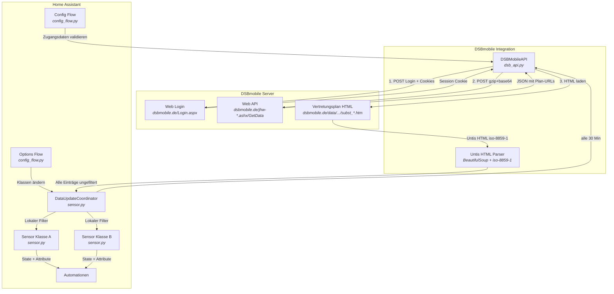
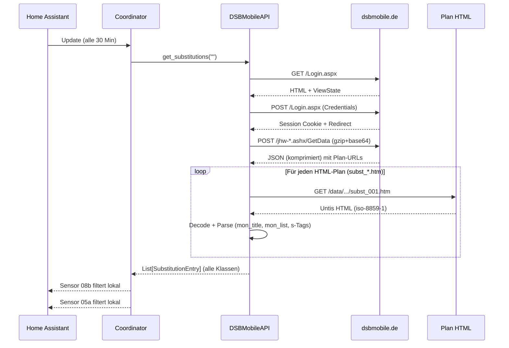
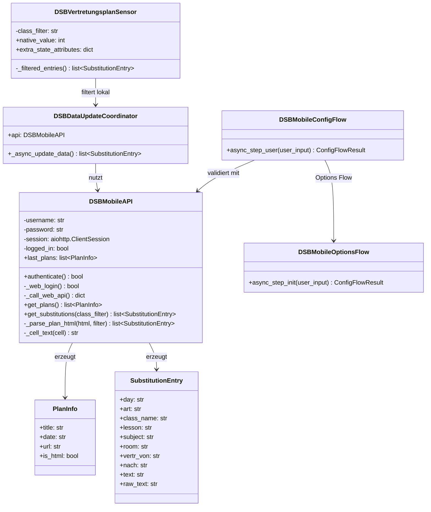

# DSBmobile Vertretungsplan – Home Assistant Integration

[](https://github.com/Tenner/dsbmobile/releases)
[](https://opensource.org/licenses/MIT)
[](https://github.com/hacs/integration)

Custom Integration für [Home Assistant](https://www.home-assistant.io/), die den Vertretungsplan von [DSBmobile](https://www.dsbmobile.de/) ausliest und als Sensor bereitstellt.

## Features

- Automatischer Abruf des Vertretungsplans über die DSBmobile Web API
- Untis HTML-Parser (`subst_*.htm`) mit Unterstützung für durchgestrichenen Text (~~alt~~ → neu)
- Mehrere Klassen kommagetrennt konfigurierbar (z.B. `08b, 05a`) — pro Klasse ein eigener Sensor
- Klasse nachträglich änderbar über Konfigurieren (Options Flow)
- Verwaiste Sensoren werden beim Entfernen von Klassen automatisch aufgeräumt
- Aktualisierung alle 30 Minuten
- Sensor-State = Anzahl der Vertretungseinträge
- Nicht-HTML-Pläne (Bilder, Dokumente) als `other_plans` Attribut verfügbar
- iso-8859-1 Encoding-Unterstützung für Untis HTML
- Vollständige UI-Konfiguration (kein YAML nötig)
- Deutsche und englische Übersetzung
- Breitbild-Dashboard (3-Spalten Grid, ein Tag pro Spalte)

## Voraussetzungen

- Home Assistant 2024.1 oder neuer
- DSBmobile-Zugangsdaten (Benutzer-ID und Passwort von der Schule)

## Dateistruktur

```
custom_components/dsbmobile/
├── __init__.py            # Integration Setup & Lifecycle
├── const.py               # Konstanten & Defaults
├── dsb_api.py             # Web API Client & Untis HTML-Parser
├── config_flow.py         # UI-Konfiguration (Config Flow + Options Flow)
├── sensor.py              # Sensor-Entity mit DataUpdateCoordinator
├── manifest.json          # HA Integration Manifest
├── strings.json           # UI-Texte (Fallback)
└── translations/
    ├── de.json            # Deutsche Übersetzung
    └── en.json            # Englische Übersetzung
```

---

## Installation

### Manuell

1. Den Ordner `custom_components/dsbmobile/` in das Home Assistant Konfigurationsverzeichnis kopieren:

   ```
   /config/custom_components/dsbmobile/
   ```

   Bei einer typischen Installation liegt das Konfigurationsverzeichnis unter:
   - Home Assistant OS / Supervised: `/config/`
   - Docker: das gemountete Volume, z.B. `/home/homeassistant/.homeassistant/`
   - Core: `~/.homeassistant/`

2. Home Assistant neu starten:
   - Über die UI: **Einstellungen → System → Neustart**
   - Oder per CLI: `ha core restart`

### Über HACS (Custom Repository)

1. In HACS auf die drei Punkte oben rechts klicken → **Benutzerdefinierte Repositories**
2. Repository-URL eingeben: `https://github.com/Tenner/dsbmobile`
3. Kategorie: **Integration**
4. Hinzufügen und installieren
5. Home Assistant neu starten

---

## Einrichtung

1. Nach dem Neustart: **Einstellungen → Geräte & Dienste → Integration hinzufügen**
2. Nach `DSBmobile` suchen
3. Zugangsdaten eingeben:

   | Feld          | Beschreibung                                                  | Pflicht |
   |---------------|---------------------------------------------------------------|---------|
   | Benutzer-ID   | Die DSBmobile Kennung (von der Schule erhalten)               | Ja      |
   | Passwort      | Das zugehörige Passwort                                       | Ja      |
   | Klasse(n)     | Kommagetrennt, z.B. `08b` oder `08b, 05a` (leer = alle)      | Nein    |

4. Die Integration prüft die Zugangsdaten sofort. Bei Erfolg werden die Sensoren angelegt.
5. Klasse(n) nachträglich ändern: **Einstellungen → Geräte & Dienste → DSBmobile → Konfigurieren**

---

## Sensor

Pro konfigurierter Klasse wird ein Sensor erstellt:

| Eigenschaft     | Wert                                                |
|-----------------|-----------------------------------------------------|
| Entity-ID       | `sensor.vertretungsplan_08b` (je nach Klasse)       |
| State           | Anzahl der aktuellen Vertretungseinträge (Integer)  |
| Icon            | `mdi:school`                                        |
| Aktualisierung  | Alle 30 Minuten                                     |

### Attribute

| Attribut       | Typ    | Beschreibung                              |
|----------------|--------|-------------------------------------------|
| `class_filter` | String | Die konfigurierte Klasse                  |
| `count`        | Int    | Anzahl der Einträge                       |
| `entries`      | Liste  | Liste aller Vertretungseinträge (Details) |
| `other_plans`  | Liste  | Nicht-HTML-Pläne (Bilder, Dokumente)      |

Jeder Eintrag in `entries` enthält (Untis-Spalten):

| Feld         | Beispiel                    | Beschreibung                          |
|--------------|-----------------------------|---------------------------------------|
| `day`        | `16.4.2026 Donnerstag`      | Tag aus `div.mon_title`               |
| `art`        | `Entfall`                   | Art der Änderung                      |
| `class`      | `08b`                       | Betroffene Klasse(n)                  |
| `lesson`     | `3`                         | Stunde                                |
| `subject`    | `~~Ma~~ De`                 | Fach (durchgestrichen = altes Fach)   |
| `room`       | `A204`                      | Raum                                  |
| `vertr_von`  | `Do-16.4. / 6`              | Vertreten von                         |
| `nach`       | `Entfall für Lehrer`        | (Le.) nach                            |
| `text`       | `Klausur wird geschrieben`  | Zusatztext                            |

---

## Beispiel-Dashboard

Ein fertiges Breitbild-Dashboard (1920x1200) liegt unter [`examples/dashboard.yaml`](examples/dashboard.yaml):

- Mushroom-Header mit Anzahl und Status-Farbe (rot/grün)
- 3-Spalten Grid: ein Tag pro Spalte nebeneinander
- Einträge einzeilig mit beschrifteten Feldern
- Durchgestrichener Text wird als ~~Markdown~~ gerendert
- Verlaufsgraph über 7 Tage

Voraussetzungen: `mushroom-cards` und `layout-card` (beide über HACS).

---

## Beispiel-Automationen

### Push-Benachrichtigung bei neuen Vertretungen

```yaml
automation:
  - alias: "Vertretungsplan Benachrichtigung"
    trigger:
      - platform: state
        entity_id: sensor.vertretungsplan_08b
    condition:
      - condition: numeric_state
        entity_id: sensor.vertretungsplan_08b
        above: 0
    action:
      - service: notify.mobile_app_dein_handy
        data:
          title: "Vertretungsplan"
          message: >
            {{ states('sensor.vertretungsplan_08b') }} Vertretung(en):
            
            {{ e.day }} · {{ e.art }} · {{ e.lesson }}. Std · {{ e.subject }} · Raum: {{ e.room }} · {{ e.text }}
            
```

### Tägliche Zusammenfassung morgens um 6:30

```yaml
automation:
  - alias: "Vertretungsplan Morgenbericht"
    trigger:
      - platform: time
        at: "06:30:00"
    condition:
      - condition: numeric_state
        entity_id: sensor.vertretungsplan_08b
        above: 0
    action:
      - service: notify.mobile_app_dein_handy
        data:
          title: "Vertretungsplan heute"
          message: >
            {{ states('sensor.vertretungsplan_08b') }} Änderung(en):
            
            {{ e.art }}: {{ e.lesson }}. Std {{ e.subject }} ({{ e.room }}) – {{ e.text }}
            
```

---

## Technische Details

### API

Die Integration nutzt die DSBmobile **Web API** — den gleichen Endpoint, den auch die DSBmobile-Webseite verwendet:

1. **Web Login**: `POST https://www.dsbmobile.de/Login.aspx` mit ASP.NET Formular (ViewState, EventValidation)
   → Setzt Session-Cookies

2. **Daten abrufen**: `POST https://www.dsbmobile.de/jhw-*.ashx/GetData` mit gzip-komprimiertem, base64-kodiertem JSON-Payload
   → Gibt komprimierte JSON-Antwort mit allen Plänen, Aushängen und Dokumenten zurück

3. **HTML-Pläne laden**: `GET https://dsbmobile.de/data/.../subst_001.htm` (iso-8859-1 kodiert)
   → Untis-HTML wird mit BeautifulSoup geparst, `<s>` Tags werden zu `~~Strikethrough~~` konvertiert

### Architektur



### Datenfluss



### Komponentenübersicht



---

## Troubleshooting

| Problem                          | Lösung                                                                 |
|----------------------------------|------------------------------------------------------------------------|
| Integration nicht sichtbar       | HA neu starten, Ordnerstruktur prüfen (`custom_components/dsbmobile/`) |
| "Ungültige Zugangsdaten"         | Benutzer-ID und Passwort auf dsbmobile.de prüfen                       |
| Sensor zeigt 0                   | Klasse exakt wie im Plan eingeben (z.B. `08b` nicht `8b`)             |
| Keine Aktualisierung             | Entwicklerwerkzeuge → Dienste → `homeassistant.update_entity`          |
| Update von v1.x auf v2.x        | Integration löschen und neu einrichten (Auth-Methode geändert)         |
| Klasse ändern                    | Einstellungen → Geräte & Dienste → DSBmobile → Konfigurieren          |
| Fehler im Log                    | Debug-Logging aktivieren (siehe unten)                                 |

### Debug-Logging aktivieren

In `configuration.yaml`:

```yaml
logger:
  default: warning
  logs:
    custom_components.dsbmobile: debug
```

---

## Lizenz

MIT License – frei verwendbar und anpassbar.
