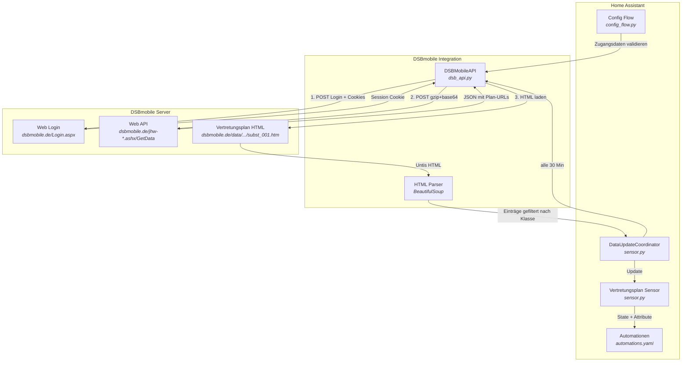
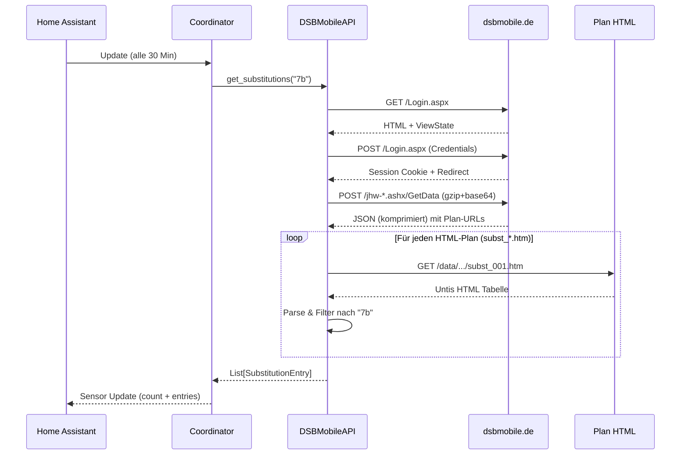
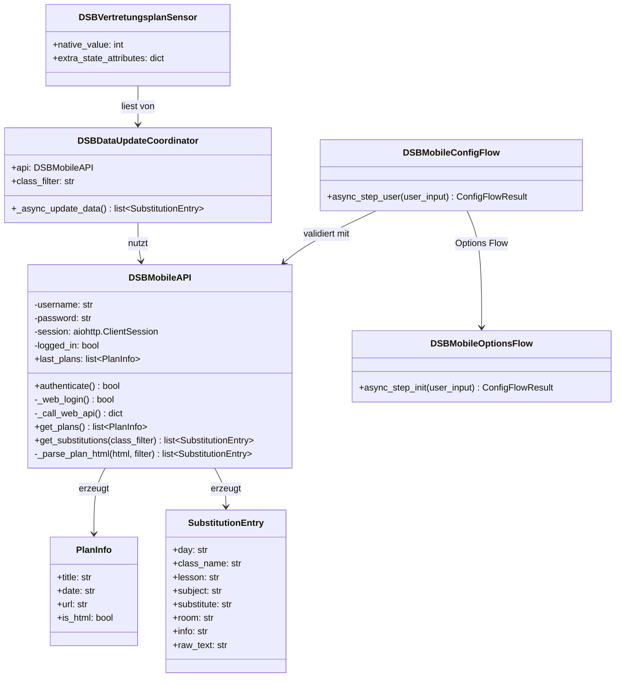

# DSBmobile Vertretungsplan – Home Assistant Integration

[](https://github.com/Tenner/dsbmobile/releases)
[](https://opensource.org/licenses/MIT)
[](https://github.com/hacs/integration)

Custom Integration für [Home Assistant](https://www.home-assistant.io/), die den Vertretungsplan von [DSBmobile](https://www.dsbmobile.de/) ausliest und als Sensor bereitstellt.

## Features

- Automatischer Abruf des Vertretungsplans über die DSBmobile Web API
- Unterstützt HTML-Pläne (Untis `subst_*.htm`) und erkennt Bild-/Dokumentpläne
- Filterung nach Klasse (z.B. `7b`, `10a`)
- Klasse nachträglich änderbar über Konfigurieren (Options Flow)
- Aktualisierung alle 30 Minuten
- Sensor-State = Anzahl der Vertretungseinträge
- Detaillierte Einträge (Tag, Stunde, Fach, Vertreter, Raum, Hinweis) als Sensor-Attribute
- Nicht-HTML-Pläne (Bilder, Dokumente) als `other_plans` Attribut verfügbar
- Vollständige UI-Konfiguration (kein YAML nötig)
- Deutsche und englische Übersetzung

## Voraussetzungen

- Home Assistant 2024.1 oder neuer
- DSBmobile-Zugangsdaten (Benutzer-ID und Passwort von der Schule)

## Dateistruktur

```
custom_components/dsbmobile/
├── __init__.py            # Integration Setup & Lifecycle
├── const.py               # Konstanten (API-URLs, Defaults)
├── dsb_api.py             # API-Client & HTML-Parser
├── config_flow.py         # UI-Konfiguration (Config Flow)
├── sensor.py              # Sensor-Entity mit DataUpdateCoordinator
├── manifest.json          # HA Integration Manifest
├── strings.json           # UI-Texte (Fallback)
└── translations/
    ├── de.json            # Deutsche Übersetzung
    └── en.json            # Englische Übersetzung
```

---

## Installation

### Manuell

1. Den Ordner `custom_components/dsbmobile/` in das Home Assistant Konfigurationsverzeichnis kopieren:

   ```
   /config/custom_components/dsbmobile/
   ```

   Bei einer typischen Installation liegt das Konfigurationsverzeichnis unter:
   - Home Assistant OS / Supervised: `/config/`
   - Docker: das gemountete Volume, z.B. `/home/homeassistant/.homeassistant/`
   - Core: `~/.homeassistant/`

2. Home Assistant neu starten:
   - Über die UI: **Einstellungen → System → Neustart**
   - Oder per CLI: `ha core restart`

### Über HACS (Custom Repository)

1. In HACS auf die drei Punkte oben rechts klicken → **Benutzerdefinierte Repositories**
2. Repository-URL eingeben: `https://github.com/Tenner/dsbmobile`
3. Kategorie: **Integration**
4. Hinzufügen und installieren
5. Home Assistant neu starten

---

## Einrichtung

1. Nach dem Neustart: **Einstellungen → Geräte & Dienste → Integration hinzufügen**
2. Nach `DSBmobile` suchen
3. Zugangsdaten eingeben:

   | Feld          | Beschreibung                                      | Pflicht |
   |---------------|---------------------------------------------------|---------|
   | Benutzer-ID   | Die DSBmobile Kennung (von der Schule erhalten)   | Ja      |
   | Passwort      | Das zugehörige Passwort                            | Ja      |
   | Klasse        | Klasse zum Filtern, z.B. `7b` oder `10a`          | Nein    |

4. Die Integration prüft die Zugangsdaten sofort. Bei Erfolg wird der Sensor angelegt.

---

## Sensor

Nach der Einrichtung wird ein Sensor erstellt:

| Eigenschaft     | Wert                                                |
|-----------------|-----------------------------------------------------|
| Entity-ID       | `sensor.vertretungsplan_7b` (je nach Klasse)        |
| State           | Anzahl der aktuellen Vertretungseinträge (Integer)  |
| Icon            | `mdi:school`                                        |
| Aktualisierung  | Alle 30 Minuten                                     |

### Attribute

Der Sensor stellt folgende Attribute bereit:

| Attribut       | Typ    | Beschreibung                              |
|----------------|--------|-------------------------------------------|
| `class_filter` | String | Die konfigurierte Klasse                  |
| `count`        | Int    | Anzahl der Einträge                       |
| `entries`      | Liste  | Liste aller Vertretungseinträge (Details) |
| `other_plans`  | Liste  | Nicht-HTML-Pläne (Bilder, Dokumente)      |

Jeder Eintrag in `entries` enthält:

| Feld         | Beispiel              |
|--------------|-----------------------|
| `day`        | `Montag 21.04.2025`   |
| `class`      | `7b`                  |
| `lesson`     | `3`                   |
| `subject`    | `Mathe`               |
| `substitute` | `Fr. Müller`          |
| `room`       | `A204`                |
| `info`       | `Raumänderung`        |

---

## Beispiel-Dashboard

Ein fertiges Dashboard liegt unter [`examples/dashboard.yaml`](examples/dashboard.yaml) und enthält:

- Übersichtskarte mit Anzahl und Klasse
- Vertretungstabelle (Markdown-Card, nur sichtbar wenn Vertretungen vorhanden)
- "Alles normal"-Karte wenn keine Vertretungen
- Verlaufsgraph der letzten 7 Tage
- Detailansicht gruppiert nach Tag

Einrichtung: Dashboard erstellen → Raw-Editor → YAML einfügen → Entity-IDs anpassen.

---

## Beispiel-Automationen

### Push-Benachrichtigung bei neuen Vertretungen

```yaml
automation:
  - alias: "Vertretungsplan Benachrichtigung"
    trigger:
      - platform: state
        entity_id: sensor.vertretungsplan_7b
    condition:
      - condition: numeric_state
        entity_id: sensor.vertretungsplan_7b
        above: 0
    action:
      - service: notify.mobile_app_dein_handy
        data:
          title: "Vertretungsplan"
          message: >
            {{ states('sensor.vertretungsplan_7b') }} Vertretung(en) für Klasse 7b:
            
            • {{ e.day }} – {{ e.lesson }}. Std: {{ e.subject }} ({{ e.info }})
            
```

### Tägliche Zusammenfassung morgens um 6:30

```yaml
automation:
  - alias: "Vertretungsplan Morgenbericht"
    trigger:
      - platform: time
        at: "06:30:00"
    condition:
      - condition: numeric_state
        entity_id: sensor.vertretungsplan_7b
        above: 0
    action:
      - service: notify.mobile_app_dein_handy
        data:
          title: "Vertretungsplan heute"
          message: >
            Guten Morgen! {{ states('sensor.vertretungsplan_7b') }} Änderung(en):
            
            • {{ e.lesson }}. Std {{ e.subject }}: {{ e.substitute }} ({{ e.room }}) – {{ e.info }}
            
```

---

## Technische Details

### API

Die Integration nutzt die DSBmobile **Web API** — den gleichen Endpoint, den auch die DSBmobile-Webseite verwendet:

1. **Web Login**: `POST https://www.dsbmobile.de/Login.aspx` mit ASP.NET Formular (ViewState, EventValidation)
   → Setzt Session-Cookies

2. **Daten abrufen**: `POST https://www.dsbmobile.de/jhw-*.ashx/GetData` mit gzip-komprimiertem, base64-kodiertem JSON-Payload
   → Gibt komprimierte JSON-Antwort mit allen Plänen, Aushängen und Dokumenten zurück

3. **HTML-Pläne laden**: `GET https://dsbmobile.de/data/.../subst_001.htm`
   → Untis-HTML wird mit BeautifulSoup geparst und nach Klasse gefiltert

Die Web API ist zuverlässiger als die Mobile API, da sie den gleichen Datenkanal wie die offizielle Webseite nutzt.

### Architektur



### Datenfluss



### Komponentenübersicht



---

## Troubleshooting

| Problem                          | Lösung                                                                 |
|----------------------------------|------------------------------------------------------------------------|
| Integration nicht sichtbar       | HA neu starten, Ordnerstruktur prüfen (`custom_components/dsbmobile/`) |
| "Ungültige Zugangsdaten"         | Benutzer-ID und Passwort auf dsbmobile.de prüfen                       |
| Sensor zeigt 0, obwohl es Vertretungen gibt | Klasse exakt so eingeben wie im Plan (z.B. `7b` nicht `7B` oder `Klasse 7b`) |
| Keine Aktualisierung             | Unter Entwicklerwerkzeuge → Dienste → `homeassistant.update_entity` manuell triggern |
| Fehler im Log                    | Logger aktivieren: `custom_components.dsbmobile: debug` in `configuration.yaml` |
| Update von v1.x auf v2.0        | Integration löschen und neu einrichten (Auth-Methode hat sich geändert) |
| Klasse ändern                    | Einstellungen → Geräte & Dienste → DSBmobile → Konfigurieren          |

### Debug-Logging aktivieren

In `configuration.yaml`:

```yaml
logger:
  default: warning
  logs:
    custom_components.dsbmobile: debug
```

---

## Lizenz

MIT License – frei verwendbar und anpassbar.
